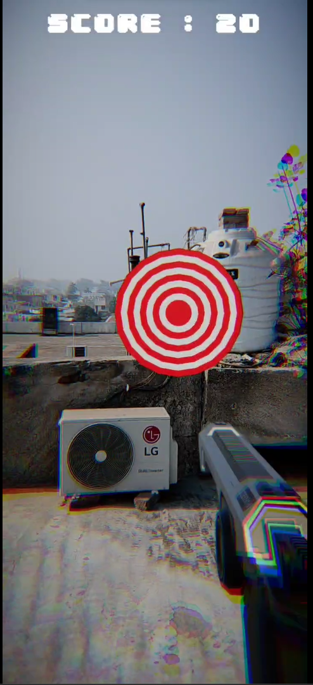

# 💡 AR Shooter
A game which enables a player to shoot boards which would increase their score
## ⚒️ Development Tools
* Unity Engine 2021.3.15f1
* Lightship ARDK 2.3.1
* Visual Studio 2019

## ⚒️ Running Locally
Make sure to use Unity 2020 or higher versions for this project to work properly.
* Download [Unity Hub](https://unity3d.com/get-unity/download "Unity Hub")
* Install Unity version 2020 or higher 
</img>
* Install Android Build Support, OpenJDK, Android SDK & NDK Tools
</img>
* Clone the repository `https://github.com/Priyanshu-CODERX/ar-shooting-board.git`
* Open the project with your Unity Engine
* Switch build platform to Android
* Go to project setting's and change the minimum api level to `Android 7.0 API Level 23`
* Switch to Gradle Version higher than 6.7
* Follow the documentation to update AndroidManifest and Base Gradle Template before building the apk
* Build the apk

## ⚒️ Documentations
* [Building For Android](https://lightship.dev/docs/ardk/ardk_fundamentals/building_android.html#doxid-building-android)